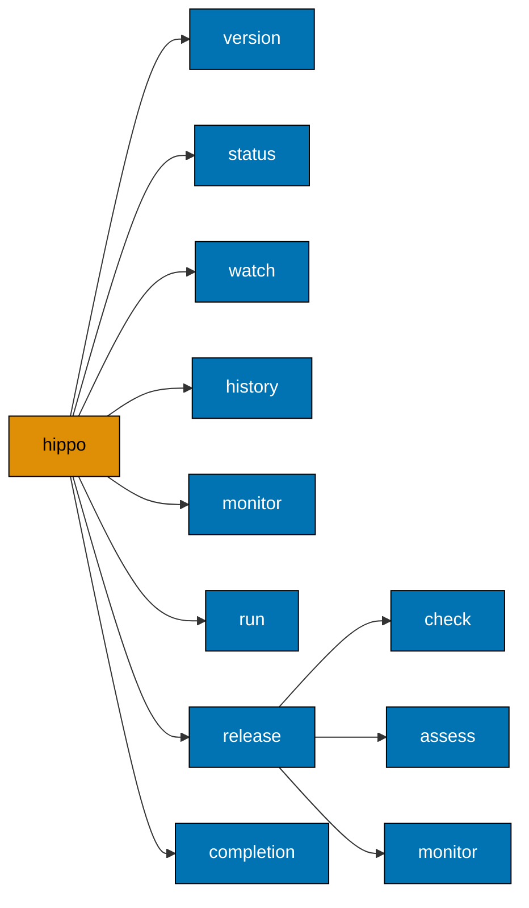

# Command-line interface

Complete command and flag inventory for the `hippo` executable. Generated from the binary's own
help output; run `hippo <command> --help` to confirm against the version you have installed.

## Command tree



| Command                 | Does                                       |
| ----------------------- | ------------------------------------------ |
| `hippo version`         | Print build version information            |
| `hippo status`          | Inspect current resource evidence          |
| `hippo watch`           | Watch resource, admission, and queue state |
| `hippo history`         | Query bounded shared run summaries         |
| `hippo monitor`         | Monitor resource-state transitions         |
| `hippo run`             | Run a command under resource supervision   |
| `hippo release`         | Check and monitor release resource safety  |
| `hippo release check`   | Check release admission and stability      |
| `hippo release assess`  | Assess a release evidence summary          |
| `hippo release monitor` | Capture release overlap evidence           |
| `hippo completion`      | Generate a shell autocompletion script     |

## Shared flags

`status`, `monitor`, `run`, and every `release` subcommand accept these.

| Flag               | Default | Meaning                                                                              |
| ------------------ | ------- | ------------------------------------------------------------------------------------ |
| `--config <path>`  | unset   | Strict local JSON configuration. Overrides `HIPPO_CONFIG` and the bootstrap default. |
| `--profile <name>` | unset   | Requested resource profile. Resolution may still fall back to a safer profile.       |

`--help` is available on every command. `version` and `completion` take no shared flags.

## `hippo version`

| Flag     | Default | Meaning                            |
| -------- | ------- | ---------------------------------- |
| `--json` | `false` | Emit the schema-1 version document |

```console
$ hippo version

$ hippo version --json
```

The text form reports the release followed by its exact source commit. The JSON form carries the
same values in `version` and `commit`. A binary built from source outside the release script reports
`dev (unknown)`, because both values are injected by `scripts/build-release.sh` at link time.

## `hippo status`

Takes one host sample, resolves a profile, and reports it. Read-only: it never admits work.

| Flag                 | Default | Meaning                                            |
| -------------------- | ------- | -------------------------------------------------- |
| `--json`             | `false` | Emit the schema-5 status document                  |
| `--disk-path <path>` | `.`     | Path whose free space is measured                  |
| `--source <label>`   | unset   | Filter owner and waiter rows by source             |
| `--tag <key=value>`  | none    | Filter rows by a label; repeatable, all must match |

```console
$ hippo status --disk-path .
state=normal reason=normal profile=balanced concurrency=8 swap=active availableGiB=13.76 diskFreeGiB=78.67 cpu=15.5% owners=2 waiters=7 ownerLimit=2 promotion=insufficient-overlap-runs
```

The JSON form includes privacy-safe owner/waiter rows plus the base, maximum, and currently effective
owner limit. A live exclusive compatibility session appears as a legacy owner, while exclusive
waiters remain unregistered. Filters change rows, not the global aggregate totals. It is documented in
[JSON schemas](./json-schemas.md#status---json).

## `hippo watch`

Runs `status` repeatedly and prints only changed snapshots. This is the operator view for owners,
FIFO position, admission deadline, and promotion state; `monitor` remains the lower-level resource
transition stream.

| Flag                    | Default | Meaning                                            |
| ----------------------- | ------- | -------------------------------------------------- |
| `--interval <duration>` | `5s`    | Minimum delay between status snapshots             |
| `--json`                | `false` | Emit one schema-5 object per changed snapshot      |
| `--disk-path <path>`    | `.`     | Path whose free space is measured                  |
| `--source <label>`      | unset   | Filter owner and waiter rows by source             |
| `--tag <key=value>`     | none    | Filter rows by a label; repeatable, all must match |

## `hippo history`

Reads current and daily compacted summaries from the shared root. It never emits commands,
arguments, working directories, or repository paths.

| Flag                     | Default | Meaning                                        |
| ------------------------ | ------- | ---------------------------------------------- |
| `--since <duration>`     | `30d`   | Positive rolling window, at most 30 days       |
| `--source <label>`       | unset   | Filter by source                               |
| `--tag <key=value>`      | none    | Filter by label; repeatable, all must match    |
| `--class <name>`         | unset   | Filter by task class                           |
| `--resource-tier <name>` | unset   | Filter by resource tier                        |
| `--outcome <name>`       | unset   | Filter by outcome                              |
| `--json`                 | `false` | Emit one schema-1 document with a `rows` array |
| `--jsonl`                | `false` | Emit one summary object per line               |

`--json` and `--jsonl` are mutually exclusive.

## `hippo monitor`

Prints the initial state, then one line per state or profile transition. Runs until cancelled.

| Flag                    | Default | Meaning                                      |
| ----------------------- | ------- | -------------------------------------------- |
| `--json`                | `false` | Emit one schema-1 JSON object per transition |
| `--disk-path <path>`    | `.`     | Path whose free space is measured            |
| `--interval <duration>` | `1s`    | Sample interval                              |

```console
$ hippo monitor --interval 1s --disk-path .
2026-09-07T04:55:25.508138Z state=normal reason=normal profile=balanced swap=active
^C

$ hippo monitor --interval 1s --json --disk-path .
{"schemaVersion":1,"measuredAt":"2026-09-07T04:55:28.569948Z","state":"normal","reason":"normal","profile":"balanced","swapState":"active"}
^C
```

## `hippo run`

Admits, supervises, and sheds one guarded command. The `--` boundary is mandatory so the guarded
command's own arguments are never parsed as hippo flags.

```text
hippo run [flags] -- <command> [arguments...]
```

| Flag                              | Default     | Meaning                                                               |
| --------------------------------- | ----------- | --------------------------------------------------------------------- |
| `--class <name>`                  | `ephemeral` | Task class: `ephemeral`, `service`, or `transactional`                |
| `--cwd <path>`                    | unset       | Child working directory                                               |
| `--disk-path <path>`              | unset       | Path whose free space is measured                                     |
| `--reserve-cpu <n>`               | `0`         | Fixed CPU reservation; `0` selects the automatic fair share           |
| `--reserve-memory-mib <n>`        | `0`         | Fixed memory reservation in MiB; `0` selects the automatic fair share |
| `--resource-tier <name>`          | unset       | `light`, `standard`, or `heavy`; required by schema 3                 |
| `--source <label>`                | identity    | Override the discovered `hippo.identity.json` source                  |
| `--tag <key=value>`               | identity    | Override/add a privacy-safe label; repeatable, last duplicate wins    |
| `--concurrency-env <NAME>`        | none        | Child variable that receives resolved concurrency; repeatable         |
| `--wait-for-admission <duration>` | `0`         | Schema-2 FIFO deadline override; schema 3 uses the selected tier      |
| `--lease-port <n>`                | `0`         | Service port to lease                                                 |
| `--lease-owner <name>`            | unset       | Service port owner                                                    |
| `--lease-min <n>`                 | `0`         | Minimum allowed leased port                                           |
| `--lease-max <n>`                 | `0`         | Maximum allowed leased port                                           |

The child keeps the caller's stdin, stdout, and stderr. Guard diagnostics go to stderr only. A normal
child exit code is passed through unchanged. Capacity waiting creates one FIFO identity and does not
launch the payload until admitted. A heartbeat reports that run ID, queue position, and remaining
deadline every 30 seconds. Expiry returns `124` naming `hippo.limit.capacity-deferred`, with a `never-started` safety receipt; HIPPO never
retries a payload.

```console
$ hippo run --class ephemeral --resource-tier light --disk-path . -- sh -c 'echo build-started; echo build-finished'
build-started
build-finished

$ hippo run --resource-tier light --disk-path . -- sh -c 'exit 42'
$ echo $?
42
```

`--reserve-cpu` and `--reserve-memory-mib` apply in reservation mode. An explicit reservation may be
smaller than the automatic share but never below one CPU or 256 MiB; see
[Configuration](./configuration.md) to enable reservation mode.

Schema 3 grants the largest launch-time vector that fits between the selected tier's minimum and
maximum. It requires a valid identity from `HIPPO_IDENTITY`, upward `hippo.identity.json` discovery,
or `HIPPO_DEFAULT_IDENTITY`. An invocation override is useful for worktree context:

```sh
hippo run --resource-tier standard --tag checkout=worktree --tag plan=maximize-hippo -- make test
```

## `hippo release check`

Silent gate. Exits `0` when a release may proceed, and reports a stable exit code otherwise.

| Flag                 | Default | Meaning         |
| -------------------- | ------- | --------------- |
| `--disk-path <path>` | `.`     | Deployment path |

## `hippo release monitor`

Captures release overlap evidence. Both `--health-url` and `--routed-origin` are required; the
command fails immediately without them.

| Flag                       | Default               | Meaning                                                     |
| -------------------------- | --------------------- | ----------------------------------------------------------- |
| `--output <path>`          | unset                 | Raw JSONL sample destination; `-` streams to stdout         |
| `--summary <path>`         | unset                 | Final summary destination; `-` streams to stdout            |
| `--deployment-root <path>` | unset                 | Deployment root                                             |
| `--health-url <url>`       | `HIPPO_HEALTH_URL`    | Local health URL (required)                                 |
| `--routed-origin <origin>` | `HIPPO_ROUTED_ORIGIN` | Bare HTTPS routed origin (required)                         |
| `--service-port <n>`       | none                  | Service port included in RSS accounting; repeatable         |
| `--duration-ms <n>`        | `0`                   | Stop after this many milliseconds; `0` runs until cancelled |

`--output -` and `--summary -` cannot both be used in one invocation, because raw and summary
schemas must never be mixed on one stream:

```console
$ hippo release monitor --output - --summary - ...
Error: raw evidence and summary cannot both use standard output
```

## `hippo release assess`

Reads a release summary and decides whether the evidence stays inside the release envelope.

| Flag               | Default | Meaning                            |
| ------------------ | ------- | ---------------------------------- |
| `--summary <path>` | unset   | Summary JSON path; `-` reads stdin |

```console
$ hippo release assess --summary summary.json
{"accepted":true,"schemaVersion":5}
```

Rejected evidence prints `"accepted":false` and returns exit `124`:

```console
$ hippo release assess --summary summary.json
{"accepted":false,"schemaVersion":5}
release overlap exhausted resource or routed responsiveness headroom
$ echo $?
75
```

Assessment accepts retained schema 2–5 summaries. New summaries are schema 5.

## `hippo completion`

Cobra-generated scripts for `bash`, `fish`, `powershell`, and `zsh`.

```console
$ hippo completion zsh > "${fpath[1]}/_hippo"
```

## Usage errors

A usage mistake prints the command usage next to its diagnostic and returns exit `1`. A failure that
happens after the arguments were accepted prints only the diagnostic, so consumer logs keep the real
cause instead of a flag list.

```console
$ hippo run --disk-path . echo hi
Error: run requires -- followed by a command
Usage:
  hippo run -- <command> [arguments...] [flags]
...
```

Invalid `--concurrency-env` _names_ are usage errors (`1`). Invalid mapped _values_ inherited from
the caller's environment are usage mistakes (`2`, `hippo.args.invalid`). See [Exit codes](./exit-codes.md).

## Related

- [Exit codes](./exit-codes.md)
- [Environment variables](./environment-variables.md)
- [Configuration](./configuration.md)
