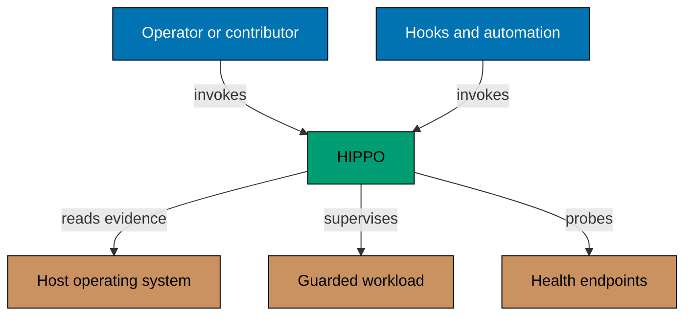
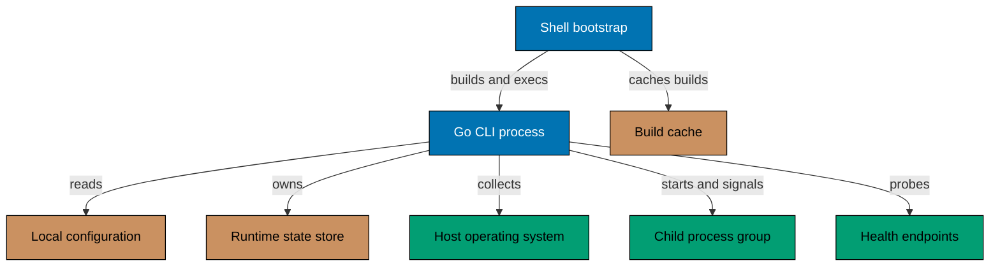
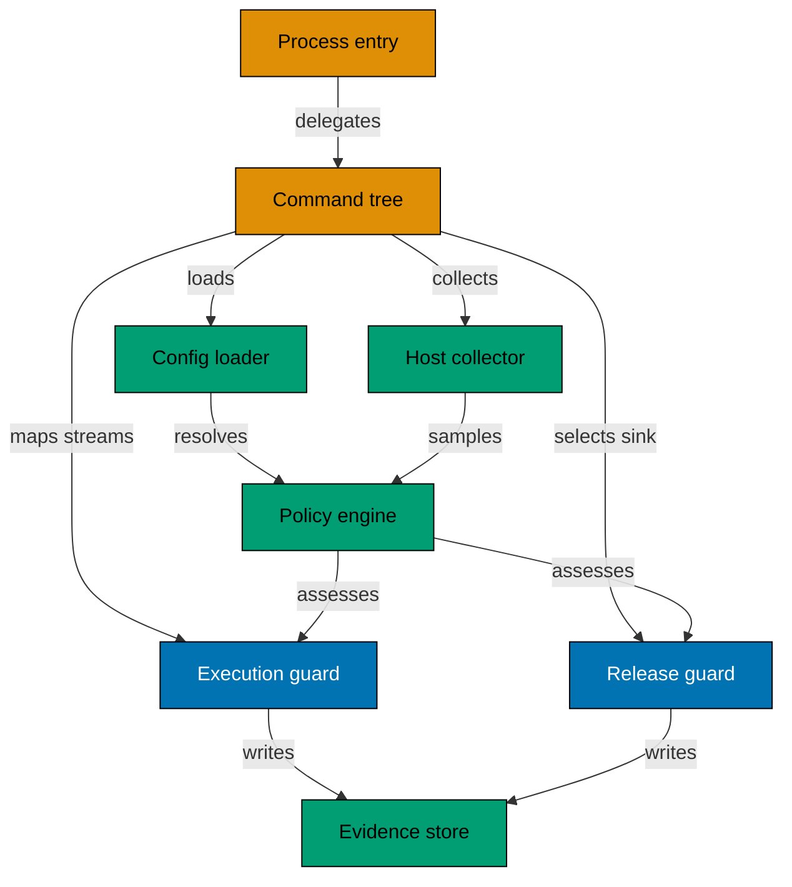
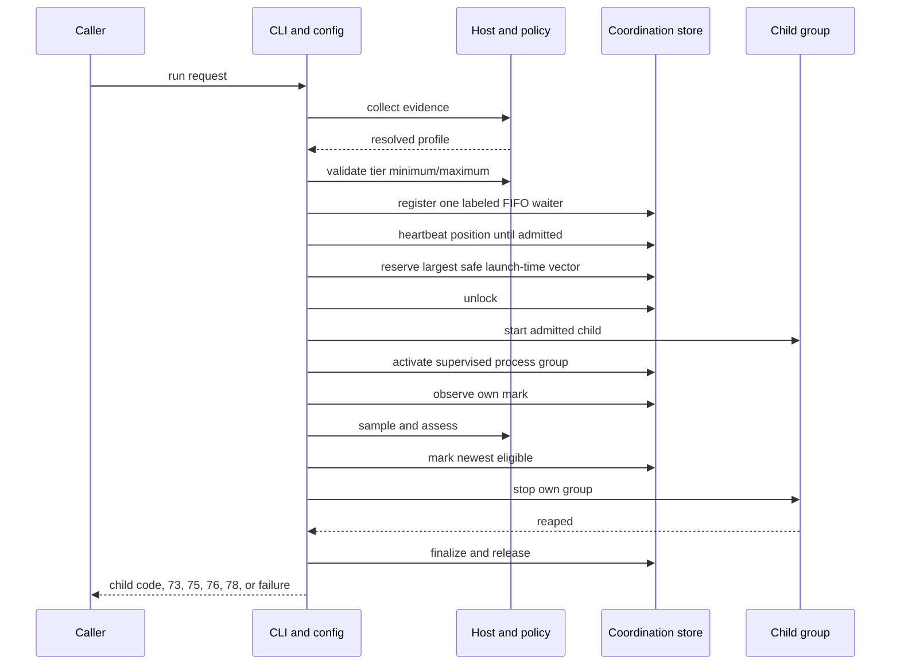

# HIPPO Architecture

This document is the canonical as-built C4 model for HIPPO — Host Infrastructure Pressure &
Process Orchestrator. It describes the public system boundary, runtime containers, internal
responsibilities, and material constraints without prescribing any consuming repository's
architecture.

The diagrams are Mermaid. Every relationship and constraint also appears in searchable prose beside its diagram, so the model stays complete for a reader who cannot see it.

## System Context

An operator, repository script, Git hook, or CI task invokes HIPPO before compute-bearing local work. HIPPO reads normalized host evidence, resolves a safe capacity profile, and atomically coordinates eligible work through a shared CPU-and-memory reservation ledger. Every service, ephemeral, and transactional owner participates. A schema-1 exclusive bridge remains for v0.3.1 consumers during rollout. Each guard supervises and signals only the child process group it owns; remote guards coordinate pressure shedding through an owner mark and never signal one another's groups. Callers may select environment variables that receive fixed allocated concurrency and may connect standard streams without teaching HIPPO about a build ecosystem. Release monitoring may probe explicit local and routed health endpoints supplied by the caller. HIPPO is repository-independent and does not know consumer project layouts, commands, or infrastructure defaults.

## Container View

`Shell bootstrap`, `Go CLI process`, `Build cache`, `Local configuration`, and
`Runtime state store` are inside the HIPPO system boundary; `Host operating
system`, `Child process group`, and `Health endpoints` are outside it.

The POSIX shell bootstrap hashes the Go sources and module metadata, serializes compilation, retains a bounded platform cache, and then replaces itself with the compiled executable. Tagged-release consumers may invoke a verified binary directly and bypass this source-build container.

The Go CLI is the only long-running HIPPO execution container. It reads an optional machine-local JSON configuration, collects host and process evidence through operating-system interfaces, and stores coordination, lease, and bounded evidence records in a shared per-user state root. HIPPO instances launched by different repositories coordinate through that same root. The configuration and state roots are runtime inputs; neither is committed to this repository. A guarded command runs as a distinct child process group so interruption and pressure shedding cannot target unrelated processes.

## Component View

Every component above sits inside the `Go CLI process` container.

- **Process entry** maps the operating-system argument vector to the application's exit code.
- **Command tree** owns Cobra commands, flags, validation, stdin/stdout selection, and dependency injection.
- **Config loader and profiles** resolve configuration precedence, select schema-1 exclusive, schema-2 reservation, or schema-3 adaptive coordination, validate tiers, promotion, caps, and owner shares, and preserve compiled safety floors.
- **Host collector** normalizes macOS, Linux, cgroup, swap, pressure, CPU, disk, and process evidence into portable samples.
- **Policy engine and profiles** classify evidence, choose an adaptive development profile, and preserve strict transaction and release envelopes.
- **Execution guard** owns coordination mode, atomic vector and FIFO mutations, liveness identities, compatibility and port leases, controlling-terminal ownership, child-process lifecycle and streams, fixed generic concurrency mapping, targeted pressure shedding, and bounded evidence retention.
- **Release guard** owns consecutive release admission, health sampling, file or caller-owned stream sinks, summary schemas, and final overlap assessment.
- **Evidence store** owns live-writer admission, raw chunk rotation, fixed-memory quantiles, safe labels,
  daily gzip compaction, bounded history queries, promotion evidence, safety receipts, and expiry.

The `internal/policy` package owns the shared typed samples, collectors, task classes, decisions, thresholds, and profile resolution. Execution, platform collection, and release monitoring depend directly on that package instead of a forwarding facade or consumer-specific application types. Long-running operations receive caller-owned contexts; only the process entry translates operating-system signals into cancellation.

## Guarded Execution Dynamic View

Admission failures return before child creation. Schema 2 derives a safe vector from host parallelism and effective memory, applies optional caps, and divides automatic requests by profile shares of four, two, or one. Schema 3 requires light, standard, or heavy tier bounds and grants the largest launch-time vector that fits between the chosen minimum and maximum. Explicit dimensions cannot cross one CPU or 256 MiB or leave their schema-3 tier. Checked subtraction verifies both dimensions without integer wrap. Impossible requests replan immediately; temporary exhaustion holds one stable strict-FIFO identity until admission or its tier deadline. No payload retry loop exists. The effective active-owner limit is the conservative live minimum. Schema 3 defaults to two owners and opens a third only after the configured newest overlapping runs pass the multi-source memory, pressure, CPU p95, swap, and shedding criteria. Inheritance reuses the token's fixed allocation without a second owner. Host thresholds remain authoritative after budget fit.

An admitted child inherits its fixed profile, allocated CPU, reserved memory, clamped caller-selected concurrency mappings, and caller-owned streams. For controlling-terminal input, HIPPO gives the isolated child group foreground ownership and restores the caller group on every exit path. Critical pressure marks at most one newest ephemeral owner per locked evaluation, then one newest service when no ephemeral is eligible. Transactional owners remain protected in ordinary shedding and are considered last only after the schema-3 emergency floor is crossed. The mark carries only the selected stable exit (`73` for storage or `75` for other pressure). A remote selector waits boundedly and never signals. The owning guard observes its own mark before collecting another host sample, performs bounded TERM-to-KILL cleanup, waits/reaps, records emergency stops, and only then releases. A live unresponsive marked owner remains the global barrier against another election. HIPPO preserves a child exit code, including child-owned reserved codes. Stable guard exits remain storage cleanup (`73`), capacity or safety stop (`75`), incompatible peer protocol (`76`), and local replanning (`78`). Corrupt state or a HIPPO-owned activation failure returns `1`; the latter records `task-failed` plus `started-activation-failure`. Receipts distinguish never-started waiters from every started outcome.

## Architectural Constraints

- The public CLI and defaults remain generic across consuming repositories; consumers supply commands, paths, ports, health endpoints, and local policy inputs.
- Supported runtime collectors normalize macOS and Linux evidence, including effective cgroup limits where available, without assuming one machine shape.
- Machine-local schema-2 configuration may tighten vector caps and owner counts. Schema 3 requires explicit pool, base/maximum owner, promotion, emergency, and three-tier settings. Neither may weaken the one-CPU, 256 MiB, or 20-owner compiled floors and ceilings. The shared-root owner cap is the conservative minimum from all live owners and waiters and resets only when the ledger is idle. Schema 1 retains exclusive compatibility semantics.
- Every ledger, queue, victim, and compatibility mutation is serialized by the shared `coordination.lock`; no transaction that takes it spans a child's execution, though activation takes it once after its child has started, to record the supervised process group. Schema-2 `reservations.json` records only capacity, vectors, classes, profiles, monotonic sequence, diagnostic PIDs, process groups, configuration hashes, and the numeric 73/75 shedding cause.
- Decoded reservation state must satisfy strict token, class, sequence, nonnegative-vector, checked-total, owner/waiter, owner-limit, and shedding-state invariants. Corruption fails closed and preserves bytes; admission uses subtraction-based vector checks so aggregate arithmetic cannot wrap.
- A missing reservation ledger is an empty epoch only when mode and identity evidence positively prove it; unknown identity errors retain accounting. Lifecycle lock waits are bounded, failed release retains owner identity evidence, cancelled waiter cleanup receives a fresh bounded context, and exhausted FIFO sequences reset only after a positively empty epoch.
- Per-token advisory identities carry device and inode metadata plus a same-inode recovery anchor, rather than trusting diagnostic PID equality. A private capability-authenticated HIPPO launcher exclusively holds both reservation and port identities while supervising the complete command group; arbitrary payloads and descendants cannot inherit or forge those descriptors. Supervisor-only death, leader exit, or payload descriptor closure therefore retains accounting until positive group retirement. Unknown or unreaped retirement stays fail closed, while a positively stale identity is reclaimed even when the diagnostic PID has been reused. New schema-1 ownership follows the same lifetime; legacy zero-metadata PID records remain conservative. Inherited tokens must still identify a live locked owner.
- Reservation mode cannot replace active schema-1 exclusive state, and compatibility mode cannot replace reservation state. Both valid live protocol conflicts preserve the existing mode and return `76` before child creation. Schema 3 likewise returns `76` while live schema-2 entries lack v1 metadata. Configuration-hash differences are not protocol mismatches; conservative limits still compose.
- Compatibility heavy work continues to use one shared per-user `heavy.lock`; services retain independent inheritable compatibility sessions. Malformed heavy state, an unreadable session directory, malformed or unreadable service-session records, and failed positively-stale heavy-state removal stay byte-preserving and fail-closed during reservation takeover. A reservation marker is written only after positive empty/stale proof and successful cleanup, so mixed epochs cannot be created.
- An unreadable or malformed heavy-work owner, service session, or compatibility inventory returns `1` and is never reclaimed automatically. A valid owner, session, coordination marker, or reservation ledger with an unsupported positive schema returns `76`. Both paths preserve bytes; an operator must confirm that no owner remains, restore accessibility, or upgrade the client before retrying.
- A guard signals only the process group of its own reservation or compatibility session. Remote selectors only mark and observe an owner; they never signal a foreign group and cannot select another victim while a live marked owner remains. HIPPO never sheds unrelated user, repository, proxy, or production processes. Transactional owners are excluded from ordinary selection and eligible last only at the configured emergency floor.
- Child stdin, stdout, and stderr remain caller-owned and distinct from guard diagnostics. Foreground terminal transfer applies only when inherited stdin is the controlling foreground TTY and is always restored. Consumers opt into tool concurrency mappings by valid environment name; no build system is compiled into the core.
- One shared state root admits at most 20 live evidence streams across all consuming repositories. Each live stream keeps five rotating 400 KiB raw chunks, for about 2 MiB per session and about 40 MiB at the maximum live count.
- Same-day inactive root evidence keeps the legacy 50 MiB cap. Completed prior-day raw streams compact atomically to gzip and retain seven days under 512 MiB. Prior-day summaries deduplicate by run identity into daily gzip JSONL and retain thirty days under 128 MiB; when size wins, the oldest day is first aggregated by source, exact tags, class, tier, and outcome. Receipts retain thirty days under 128 MiB. Active streams are protected by process-owned markers, and stale temporary files are bounded.
- Lifetime summaries use fixed-memory aggregates and remain complete even after older raw chunks rotate away. Validated source plus at most eight customizable tags identify work without recording command arguments, repository origins, paths, credentials, or user payloads.
- Status and development summaries use schema 5. Status includes privacy-safe owner/waiter rows, tier, deadline, legacy count, and promotion decision; `watch` streams changed status snapshots; `history` queries current and compacted summaries. Status surfaces coordination corruption instead of fabricating zero totals, and every admission event atomically raises the owning development session's peak count even between host-sampling ticks. Raw host samples retain their existing schema.
- The optional four-consumer conformance runner receives all checkout paths, names, commands, shared state, and pinned binary identity through one strict manifest. It freezes canonical absolute/symlink paths plus checkout and created shared-root filesystem identities, rejects checkout/shared-root ancestry overlap, revalidates those objects around every command, and snapshots all checkouts before any command. Bootstrap is sequential per consumer but concurrent across four lanes with a deterministic failure barrier; gates are concurrent after coordination. Every command receives a distinct read-and-execute-only copy of one safely opened verified executable; the command copy is checked after execution, and the hidden master plus manifest source are revalidated before later work and final reconciliation. Caller session/allocation outputs and the caller repository's bootstrap-only default configuration are removed before consumer commands, while an explicit configuration override remains and a consumer's own outer guard may establish nested inheritance. Every started process group must retire after normal, nonzero, or cancelled leader exit before its phase returns. Cancellation prevents later starts and owns bounded TERM/KILL/group-retirement observation; final identity plus checkout reconciliation uses a fresh bounded context. A capacity skip requires exit `75`, the documented diagnostic, and a new schema-1 `never-started` receipt; exit `76`, integrity faults, missing or invalid receipts, and cleanup faults remain fatal. The runner joins failures privately, has no product-specific defaults, and does not expose paths in validation or execution errors.
- Local configuration, runtime state, build caches, coverage, and release artifacts remain untracked. Disposable scratch uses `local-tmp/`; requested non-authoritative reports use `generated-reports/`.
- Release monitoring requires explicit health inputs, emits generic bounded file evidence or caller-owned stdout streams, rejects mixed raw and summary schemas on one stream, and keeps compatibility with supported retained summary schemas.
- Tagged release assets are immutable and originate from the exact full lowercase `HEAD` commit in a clean checkout. The owned script builds from an isolated exact-commit materialization for the supported OS/architecture matrix. Validation requires exactly four checksummed archives, one regular mode-755 member each, matching clean VCS/native identity, and rejects link or special members before extraction. The workflow peels the tag and requires its commit to be reachable from `origin/main` without adding Actions artifact, package, or cache storage.

## Behaviour Traceability

Executable behavior is specified in [`behaviours/`](behaviours/README.md). The unit adapter executes the complete recursive corpus without exemptions. Local integration and compiled-binary E2E adapters remain strict; every boundary exemption is exact and records both the blocked boundary and its reason. C4 views describe structure and responsibility; Gherkin remains authoritative for observable behavior.
